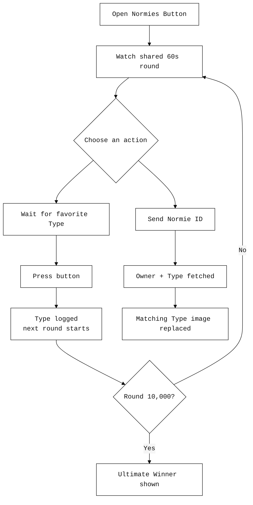
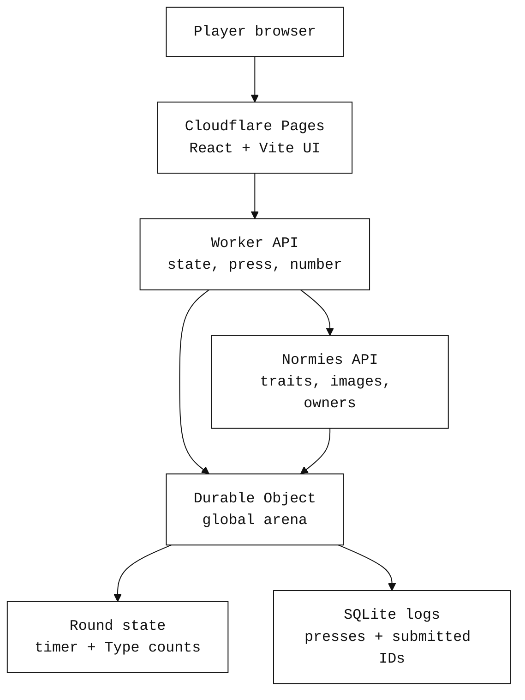
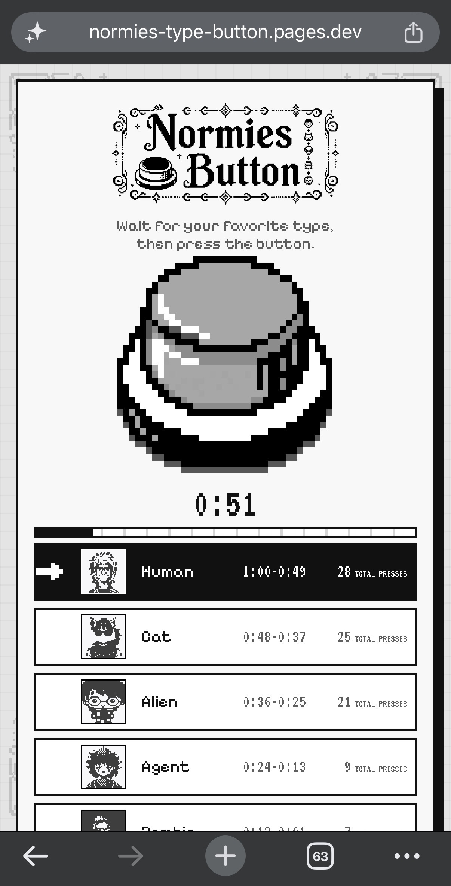
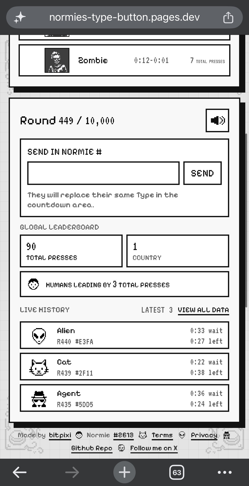

# Normies Button


**Normies Button** turns the collection's `Type` trait into a live multiplayer timing ritual. Everyone sees the same global round. Wait for your favorite Type (Human, Cat, Alien, Agent, or Zombie) then press the button. Top-pressed Type at Round 10,000 wins forever! Created and submitted by bitpixi for the Normies Hackathon on June 30th, 2026. Inspired by Reddit's "The Button" game by Josh Wardle in 2015.

[---> Play the live demo](https://normies-type-button.pages.dev/)

[---> View the full data](https://normies-type-button-api.deviantclaw.workers.dev/state)

## The Countdown

| Time left | Awarded Type |
| --- | --- |
| `1:00-0:49` | Human |
| `0:48-0:37` | Cat |
| `0:36-0:25` | Alien |
| `0:24-0:13` | Agent |
| `0:12-0:01` | Zombie |

If nobody presses before zero, the round rolls on. If someone presses, the next global round starts immediately.

Round `10000` is the final playable round. When it ends, the button freezes and declares the ultimate winning Type by total presses. It's estimated that round `10000` could complete around 7 July, 2026 (1 week). Accepted presses can end rounds early, so the real finale could arrive sooner.

## User Flow



## For the Judges

```txt
> visible API usage
> fast, walletless entry
> live multiplayer backend
> mobile responsive gameplay
> readable rules in the first screen
> safeguards for rapid or scripted presses
> monochrome pixel UI with custom sprites
> agentic music and 5 unique sound effects
```

- **Live Normies data:** pulls collection imagery and Type information from `api.normies.art`.
- **Trait-native mechanic:** `Human`, `Cat`, `Alien`, `Agent`, and `Zombie` are the countdown bands.
- **Live multiplayer:** presses, rounds, history, countries, and Type counts are coordinated server-side.
- **Responsive interface:** the game is designed for desktop and mobile play.
- **Abuse-aware backend:** one-press-per-round logic, rapid-click throttling, and repeated-timing checks reduce scripted press spam.
- **No wallet wall:** anyone can land, wait, and press. even people without Normies may be inspired to purchase.
- **Hackathon-friendly:** the live JSON endpoint exposes state for quick inspection.

### Technical Architecture



## Visual Choices

```txt
- monochrome first
- pixel glyphs for Type identity by bitpixi
- filigree HUD corners by bitpixi
- button-stack sprite with pressed state by GhostAgent
- the game is the first screen and mobile-responsive!
```

## Mobile Responsive

The mobile layout keeps the button, countdown, Type stack, submissions, leaderboard, and live history viewable within a short scroll. It is the same global game surface as desktop: every press, Type count, submitted Normie, country stat, and history row is connected in realtime to the Cloudflare Worker + Durable Object backend.

Sound is generated in-browser with Web Audio. It works on modern browsers after audio is enabled, though some mobile browsers may still limit or block sound depending on their autoplay/audio policies.

<p>
  
  
</p>

## Custom Audio

Every sound in Normies Button is custom and agentically generated in the app with Web Audio. There are no stock sound files hiding in the bundle; the browser synthesizes the music and effects live.

- **Normies Button Background Song:** a looping chiptune bed with layers that enter and drop away over time.
- **Button Press:** alternating arcade button thocks for the main press interaction.
- **Send in Normie:** a charm-like sparkle when a submitted Normie is accepted.
- **Link Open:** an upward whoosh for link-style navigation.
- **Link Close:** a downward whoosh for closing the Terms/Privacy panel.

## Tech Stack

```txt
- React 19 + TypeScript + Vite
- Cloudflare Pages frontend
- Cloudflare Worker + Durable Object backend
- Normies API integration
- Vitest coverage for timing, scoring, API fallbacks, and formatting helpers
```

## Marketing

Much of the Normies audience, besides four brave peope, told me they didn’t want to connect their wallets directly to my first Normies Hackathon entry [Scribblies](https://scribblies.deviantclaw.art/), so I listened. I started building games with no wallet connection required, and made this YouTube-thumbnail-style image using ChatGPT Pro and Google Gemini to tell that story. Thank you for considering me, and good luck to everyone! ~ bitpixi.eth

<center>
