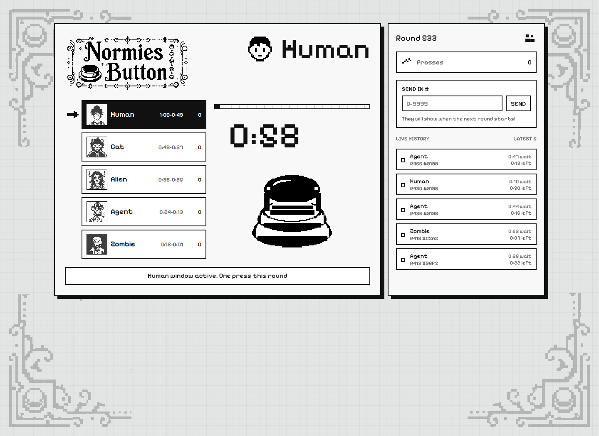

# Normies Type Button

**A global one-minute button game for the Normies Hackathon.**

[Play the live demo](https://normies-type-button.pages.dev) · [Normies API](https://api.normies.art) · [Worker state endpoint](https://normies-type-button-api.deviantclaw.workers.dev/state)



Normies Type Button turns the collection's five core Types into a shared timing arena. Everyone sees the same live round. Press early and you land in the Human window; wait longer and the round moves through Cat, Alien, Agent, then Zombie.

The hackathon prompt is simple: use the Normies API and build the best tool, game, or app around it. This entry is built for a fast judge read: live demo, visible Normies API integration, clear Type-based mechanic, and a deployed shared-state backend.

## Judge Highlights

- Uses live Normies data from `api.normies.art` for Type counts and representative token imagery.
- Makes Normies Types the game mechanic, not just a skin.
- Uses a Cloudflare Worker Durable Object to coordinate global rounds, press history, visitor lockout, and submitted token numbers.
- Walletless and instant to try.
- Custom monochrome pixel-art button, Type glyphs, cursor, logo, and HUD ornaments.

## Gameplay

Each round lasts 60 seconds:

| Time left | Awarded Type |
| --- | --- |
| `1:00-0:49` | Human |
| `0:48-0:37` | Cat |
| `0:36-0:25` | Alien |
| `0:24-0:13` | Agent |
| `0:12-0:01` | Zombie |

Players can press once per round. The app shows the active Type window, per-Type press counts, recent global history, and a small "send in #" feature for surfacing token IDs in the next round.

## Tech Stack

- React 19 + TypeScript + Vite
- Cloudflare Pages frontend
- Cloudflare Worker + Durable Object backend
- Normies API integration
- Vitest test coverage for timing, summaries, API fallback, and normalization

## Commands

```bash
npm install
npm run dev
npm test
npm run build
```

## Deploy

```bash
npm run deploy
```

This deploys the Worker API first, then the Cloudflare Pages frontend.
